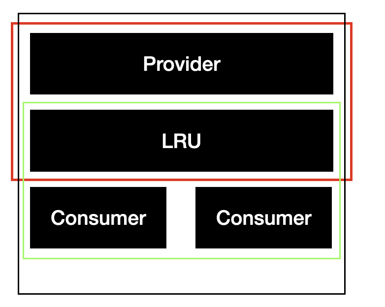

# This is a Research type of Repo

## Point 1: How to Parallel process tx in different Blocks 
### Assuming one block with different txs and txs can be id by read keys and write keys

How about a LRU Queue based parallel mode?

